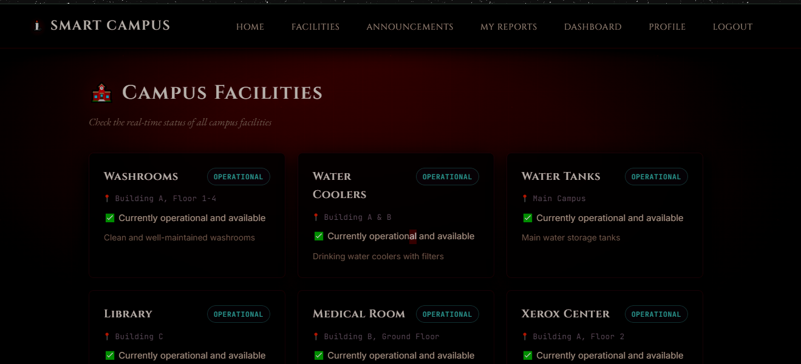
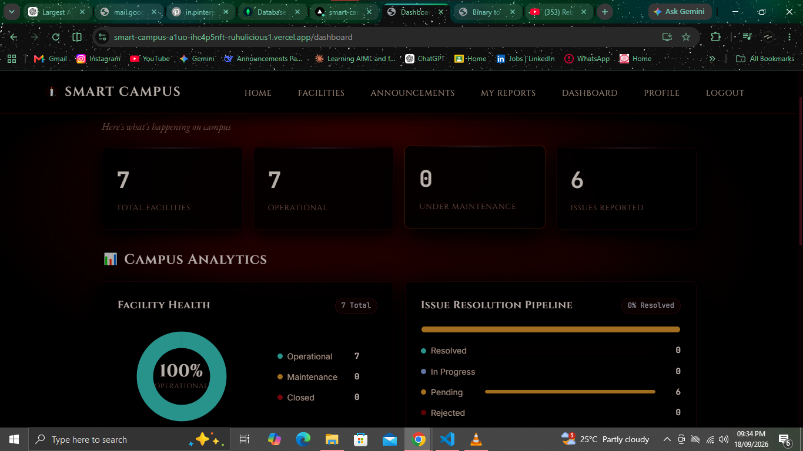

# 🏫 Smart Campus Utility & Maintenance Management System

A full-stack web application built with **Flask** and **MongoDB Atlas** to manage campus facilities, report maintenance issues, and view real-time announcements.


---

## 🚀 Features

- **🔐 Secure Authentication:** JWT-based signup/login with bcrypt password hashing and role-based access control (Student/Admin)
- **🏢 Facilities Management:** Real-time status tracking for campus facilities (operational, maintenance, closed)
- **⚠️ Issue Reporting:** Submit maintenance requests with automatic announcement generation
- **📢 Announcements System:** Priority-based campus-wide announcements with filtering
- **📊 User Dashboard:** Personalized stats dashboard showing facility status, issue counts, and recent announcements
- **📋 Issue Tracking:** Look up the status of your reported issues by email (My Reports page)
- **👤 Profile Management:** View and edit your name, email, student ID, and password
- **🛠️ Admin Panel:** Dedicated admin UI for managing facilities, publishing announcements, and updating issue statuses (role-protected)

---

## 🛠️ Tech Stack

| Layer | Technology |
|- - - - - - -|- - - - - - - - - - - -|  
| **Backend** | Python 3.10+, Flask 3.0+ |
| **Database** | MongoDB Atlas (Cloud) + Flask-PyMongo |
| **Authentication** | JWT (PyJWT), Bcrypt |
| **API Security** | Flask-CORS, Custom auth decorators |
| **Frontend** | HTML5, CSS3, Vanilla JavaScript |
| **Environment** | Dotenv for config management |

---

## 📂 Project Structure

```text
Smart Campus Project/
├── api/
│   └── index.py            # Vercel serverless entrypoint
├── backend/
│   ├── models/             # Data models (User, Facility, Issue, Announcement)
│   ├── routes/             # RESTful API blueprints (auth, facilities, issues, admin, etc.)
│   ├── schemas/            # Marshmallow request validation schemas
│   ├── utils/              # Limiter, validator, DB indexes, email notifications
│   └── create_admin.py     # CLI script to provision the first admin account
├── docs/
│   └── LinkedIn_Post_Draft.md # Social launch and post drafts
├── frontend/
│   ├── CSS/style.css       # Dark-themed responsive stylesheet
│   ├── icons/              # PWA app icons (192px, 512px)
│   ├── js/app.js           # API client, auth state, UI helpers
│   ├── manifest.json       # PWA Web App Manifest
│   ├── sw.js               # Offline service worker
│   ├── index.html          # Landing page with facility preview
│   ├── login.html          # Authentication page
│   ├── signup.html         # User registration
│   ├── dashboard.html      # Visual analytics & announcements dashboard
│   ├── facilities.html     # Facility status grid
│   ├── announcements.html  # Announcements with filtering & pagination
│   ├── report-issue.html   # Issue submission with photo attachment
│   ├── my-reports.html     # Track reported issues by user
│   ├── profile.html        # Profile management
│   └── admin.html          # Admin panel with live updates & CSV export
├── tests/                  # Automated unit and integration test suite (43 tests)
├── uploads/                # Local storage for reported issue photos (.gitkeep)
├── .env.example            # Documented environment variables template
├── .gitignore              # Git ignore rules for caches, secrets, and uploads
├── app.py                  # Primary Flask application entry point
├── Dockerfile              # Multi-stage production container build
├── docker-compose.yml      # Orchestrates Flask web app + MongoDB 6.0
├── requirements.txt        # Canonical Python dependencies
└── README.md
```

---

## 🔑 API Endpoints (39 Routes)

| Method | Endpoint | Description | Auth Required |
|--------|----------|-------------|---------------|
| `GET` | `/api/health` | Health check & DB latency ping | No |
| `POST` | `/api/auth/signup` | Register student (rate limited) | No |
| `POST` | `/api/auth/login` | User login (rate limited) | No |
| `GET` | `/api/auth/verify` | Verify JWT token | Yes |
| `GET` | `/api/auth/profile` | Get user profile | Yes |
| `PUT` | `/api/auth/profile` | Update profile | Yes |
| `GET` | `/api/facilities` | List all facilities | No |
| `POST` | `/api/facilities` | Create facility | Admin |
| `PUT` | `/api/facilities/:id` | Update facility | Admin |
| `PATCH` | `/api/facilities/:id/status` | Update facility status | Admin |
| `DELETE` | `/api/facilities/:id` | Soft-delete facility | Admin |
| `GET` | `/api/announcements` | List announcements (search & pagination) | No |
| `GET` | `/api/announcements/recent` | Recent announcements | No |
| `POST` | `/api/announcements` | Create announcement | Admin |
| `GET` | `/api/issues` | List all issues (search, filter, pagination) | No |
| `POST` | `/api/issues` | Report new issue with photo | No |
| `GET` | `/api/issues/track` | Track issues by reporter email | No |
| `PATCH` | `/api/issues/:id/status` | Update issue status (triggers email) | Admin |
| `POST` | `/api/uploads/` | Upload photo attachment (5MB limit) | No |
| `GET` | `/api/admin/users` | List users with pagination & role filters | Admin |
| `PATCH` | `/api/admin/users/:id/role` | Promote/demote role (self-guarded) | Admin |
| `PATCH` | `/api/admin/users/:id/status` | Activate/deactivate account (self-guarded) | Admin |
| `DELETE` | `/api/admin/users/:id` | Delete user account | Admin |
| `GET` | `/api/admin/export/issues.csv` | Export issues to CSV spreadsheet | Admin |
| `GET` | `/api/admin/export/facilities.csv` | Export facilities to CSV spreadsheet | Admin |
| `GET` | `/api/dashboard/stats` | Pipeline stats & facility counts | Yes |

---

## 🚀 Getting Started

### 1. Install Dependencies

```bash
pip install -r requirements.txt
```

### 2. Configure Environment

```bash
cp .env.example .env
# Edit .env with your MongoDB URI and secret key
```

### 3. Run Automated Tests

```bash
python3 -m unittest discover -s tests -v
```

### 4. Run the Application

```bash
python3 app.py
```
Or with Docker Compose:
```bash
docker compose up -d
```

The app will be available at `http://localhost:5000`

---

## 📸 Screenshots



---
